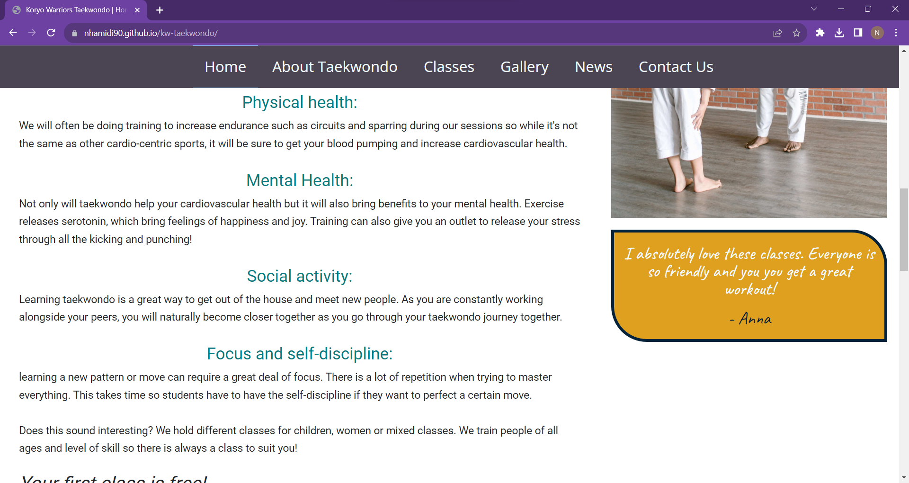
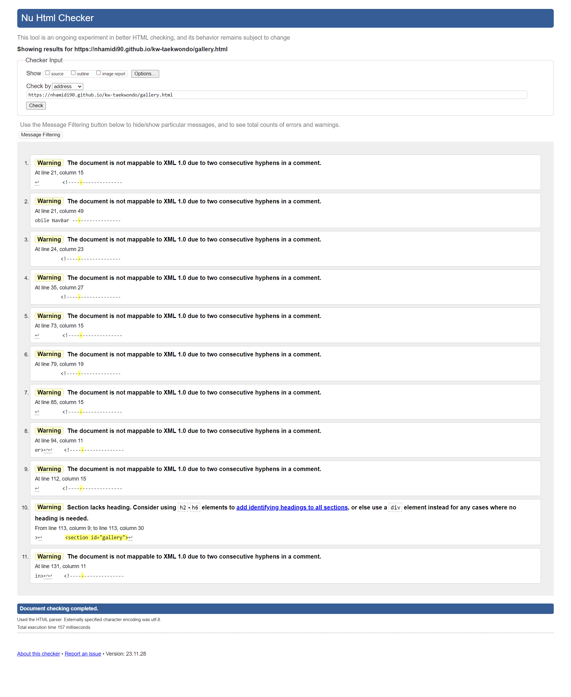
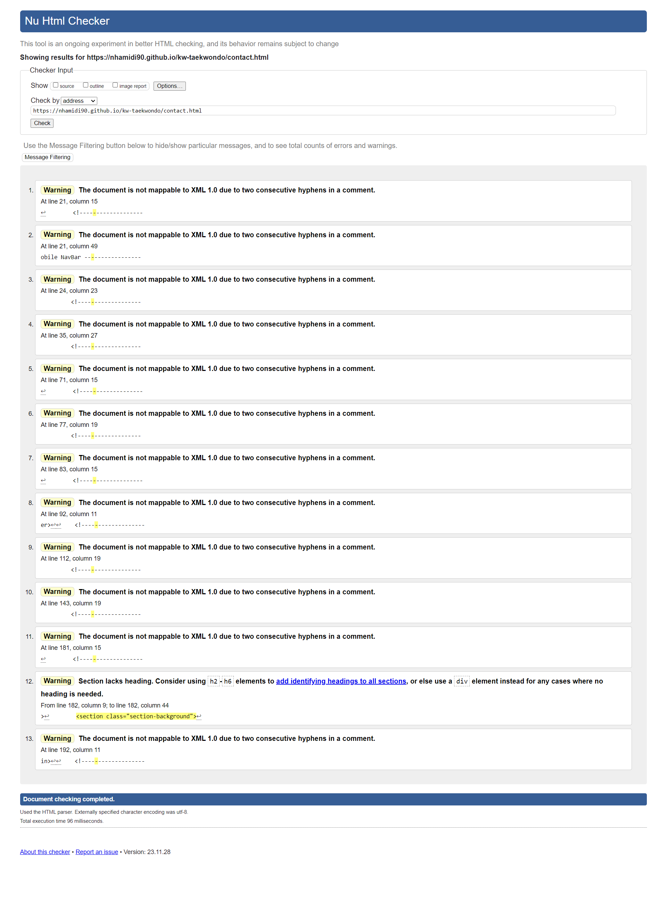
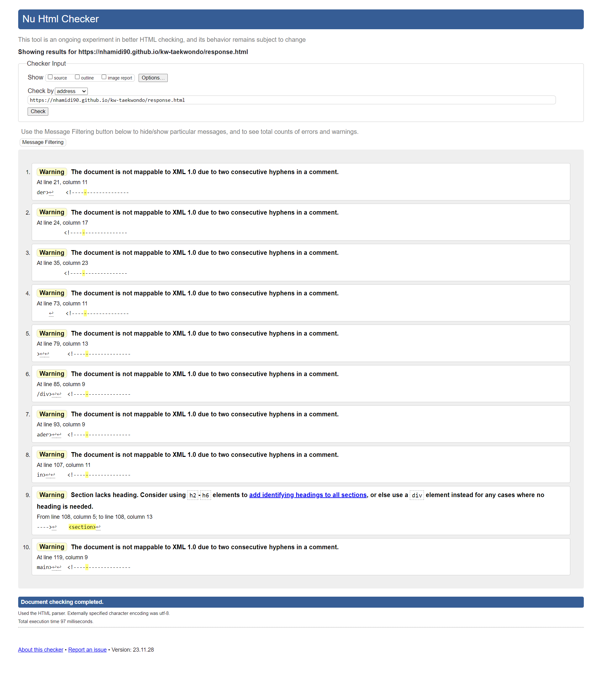
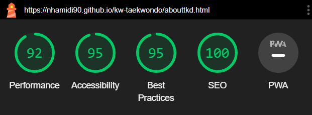
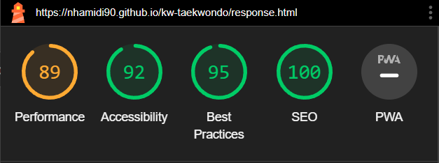

# TESTING

## Compatibility and responsiveness

* The website was tested on three browsers to determine correct appearance, responsiveness and to ensure it works well
* It was tested on Chrome, Firefox and Opera

Chrome:

Firefox:

Opera:

* The responsiveness of the site was also tested using the Chrome extension 'Responsive Viewer'

## Manual testing

|feature	|action	|expected result|	tested	|passed	|comments|
|-----------|-------|---------------|-----------|-------|--------|
|**Main Navbar**					|
|Button in top bar |Click on the "Book a free session" button| The user is redirected to the contact page | Yes | Yes | - |
|Home	|Click on the "Home" link	|The user is redirected to the main page|	Yes|	Yes	|-|
|About taekwondo	|Click on the "About Taekwondo" link|	The user is redirected to the about taekwondo page|	Yes	|Yes|	-|
|Classes and pricing|Click on the "Classes" link|	The user is redirected to the classes and pricing page|	Yes	|Yes|	-|
|Gallery	|Click on the "Gallery" link|	The user is redirected to the gallery page|	Yes	|Yes|	-|
|News	|Click on the "News" link|	The user is redirected to the news page|	Yes	|Yes|	-|
|Contact	|Click on the "Contact Us" link|	The user is redirected to the contact page|	Yes	|Yes|	-|
|**Mobile Navbar**					|
|Home	|Click on the "Home" link	|The user is redirected to the main page|	Yes|	Yes	|-|
|About taekwondo	|Click on the "About Taekwondo" link|	The user is redirected to the about taekwondo page|	Yes	|Yes|	-|
|Classes and pricing|Click on the "Classes" link|	The user is redirected to the classes and pricing page|	Yes	|Yes|	-|
|Gallery	|Click on the "Gallery" link|	The user is redirected to the gallery page|	Yes	|Yes|	-|
|News	|Click on the "News" link|	The user is redirected to the news page|	Yes	|Yes|	-|
|Contact	|Click on the "Contact Us" link|	The user is redirected to the contact page|	Yes	|Yes|	-|
|**Footer**					|
|Facebook icon in the footer|	Click on the Facebook icon|The user is redirected to the Facebook page|	Yes|	Yes	|-|
|Instagram icon in the footer|	Click on the Instagram icon|The user is redirected to the Instagram page|	Yes|	Yes	|-|
|**Home page**			|		
|"Find out more" button in about us section	|Click on the "Find out more" button|	The user is redirected to the classes page	|Yes|	Yes	|-|
|Link to British Taekwondo Council website	|Click on the "British Taekwondo Council" link|	The user is redirected to the British Taekwondo Council website	|Yes|	Yes	|-|
|**About Taekwondo  page**			|		
|Link to  UK ITF website |Click on the "UK International Taekwondo Federation" link|The user is redirected to the UK ITF page|	Yes|	Yes	|-|
|**Classes and pricing page** |
| Children's classes "Book a trial class" button | Click on the "Book a trial class" button | The user is redirected to the contact page | Yes | Yes | - |
| Children's classes hover effect | Hover over the children's class section | There will be a sweeping motion from top to bottom | Yes | Yes | - |
| Ladies classes "Book a trial class" button | Click on the "Book a trial class" button | The user is redirected to the contact page | Yes | Yes | - |
| Ladies classes hover effect | Hover over the ladies class section | There will be a sweeping motion from top to bottom | Yes | Yes | - |
| Mixed classes "Book a trial class" button | Click on the "Book a trial class" button | The user is redirected to the contact page | Yes | Yes | - |
| Mixed classes hover effect | Hover over the mixed class section | There will be a sweeping motion from top to bottom | Yes | Yes | - |
|**Contact page**|				
|Name input	|Enter your name	|The name is entered|	Yes	|Yes|	If user doesn't enter a name, an error message appears|
|Email input|	Enter your email	|The email is entered|	Yes	|Yes	|If user doesn't enter an email in the right format, an error message appears|
|Phone input|Enter your phone number |The number is entered | Yes |Yes|This is not required because users may not want to be contacted by phone|
|Message input| Enter a message| A message is entered| Yes | Yes | This is not required because users may not want to write a message |
|"Send!" button|Click on the "Send!" button	|The user is redirected to the response page|	Yes	|Yes|	-|
|Map|Drag the map and click on the zoom buttons|The map is moved around and the user can zoom in and out|	Yes	|Yes|	-|
|**Response page**					|
|Response message	|The user will be automatically redirected to the home page after 10 seconds	|The user is redirected to the home page|	Yes	|Yes|	-|

## Validator testing

### HTML

Home page

* 16 warnings were given when passing through the official W3C validator due to comments in my HTML (having two consecutive hyphens). 
* I believe this is due to WC3 being outdated. Despite these warnings, everything is working across all different devices as I checked

About Taekwondo page

* 19 warnings were given when passing through the official W3C validator due to comments in my HTML (having two consecutive hyphens)
* I believe this is due to WC3 being outdated. Despite these warnings, everything is working across all different devices as I checked

Classes page

* 15 warnings were given when passing through the official W3C validator due to comments in my HTML (having two consecutive hyphens)
* I believe this is due to WC3 being outdated. Despite these warnings, everything is working across all different devices as I checked

Gallery page

* 11 warnings were given when passing through the official W3C validator due to comments in my HTML (having two consecutive hyphens)
* I believe this is due to WC3 being outdated. Despite these warnings, everything is working across all different devices as I checked
* 1 warning was given stating 'section lacks heading'
* I understand this warning but it was my decision to not include a heading

News page

* 16 warnings were given when passing through the official W3C validator due to comments in my HTML (having two consecutive hyphens)
* I believe this is due to WC3 being outdated. Despite these warnings, everything is working across all different devices as I checked
* 3 warning was given stating 'section lacks heading'
* I understand this warning but it was my decision to not include a heading

Contact Us page

* 15 warnings were given when passing through the official W3C validator due to comments in my HTML (having two consecutive hyphens)
* I believe this is due to WC3 being outdated. Despite these warnings, everything is working across all different devices as I checked
* 1 warning was given stating 'section lacks heading'
* I understand this warning but it was my decision to not include a heading

Response page

* 10 warnings were given when passing through the official W3C validator due to comments in my HTML (having two consecutive hyphens)
* I believe this is due to WC3 being outdated. Despite these warnings, everything is working across all different devices as I checked
* 1 warning was given stating 'section lacks heading'
* I understand this warning but it was my decision to not include a heading

### CSS

* No errors were found when passing through the official W3C validator

* 10 warnings were given
* These are due to the use of webkits as the W3C is outdated and does not recognise the use of them. But the website is working 100% across all different devices as I checked

## Lighthouse report

Home page

About Taekwondo page

Classes page

Gallery page

News page

Contact Us page

Response page

## Bugs

1)	Creating a responsive website
*	When using float properties to align the divs, they would not move beneath each other when the window was resized smaller and the content would instead overlap. 
*	To solve this I used bootstrap’s grid system on most pages

2)	Creating a sticky navbar
*	I wanted to have the navbar going across the hero image sitting a few cms from the bottom. When adding code to make it sticky, it would either move from its original intended position or only be sticky and visible for as long as you could see the hero image.
*	I realised the problem occured when the navbar is placed inside the header. I am aware that the navbar is conventionally placed inside the header but for this purpose I had to bring it underneath the header.
*	When I tried to position the navbar above the hero image it wouldn’t work so I decided to discard that idea and just keep it sticky.

<!--
.nav-main {
    position: sticky;
    position: -webkit-sticky;
    top: 0;
    z-index: 1;
    text-align: center;
    align-items: center;
    background-color: #4B4453;
    height: auto;
    width: 100%;
}
-->

3)	Creating mobile menu
*	Because my navbar is not positioned at the top I had to create a separate navbar for mobile view.
*	I tried to add the toggle button into the existing top bar but it messed up the layout
*	Again I found out it had to be outside of other elements
*	I then used media queries to toggle the visibility of both navbars and the top bar

<!--
HTML

 <nav class="navbar navbar-dark">
            

                
<a href="index.html" aria-label="Go to the home page">Koryo Warriors
                        Taekwondo</a>
                

                <button class="navbar-toggler" type="button" data-bs-toggle="collapse"
                    data-bs-target="#navbarSupportedContent" aria-controls="navbarSupportedContent"
                    aria-expanded="false" aria-label="Toggle navigation">
                    
                </button>
                

                    <ul class="navbar-nav me-auto mb-2 mb-lg-0">
                        <li class="nav-item">
                            <a class="nav-link active" aria-current="page" href="index.html"
                                aria-label="Go to the home page">Home</a></li>
                        </li>
                        <li class="nav-item">
                            <a class="nav-link" href="abouttkd.html" aria-label="Learn about taekwondo">About
                                Taekwondo</a></li>
                        </li>
                        <li class="nav-item">
                            <a class="nav-link" aria-current="page" href="classes.html"
                                aria-label="Find out about classes">Classes</a></li>
                        </li>
                        <li class="nav-item">
                            <a class="nav-link" aria-current="page" href="gallery.html"
                                aria-label="Go to the gallery to see pictures of us training">Gallery</a></li>
                        </li>
                        <li class="nav-item">
                            <a class="nav-link" aria-current="page" href="news.html"
                                aria-label="Find out the latest news happening in our club">News</a></li>
                        </li>
                        <li class="nav-item">
                            <a class="nav-link" aria-current="page" href="contact.html"
                                aria-label="Click here to Contact us">Contact
                                Us</a></li>
                        </li>
                

            

        </nav>

CSS

@media screen and (max-width: 900px) {     
    
    .top-bar {
        display: none;
    }
    
    .nav-main {
        display: none;
    }
}

@media only screen and (min-width: 900px) {
    
    .navbar {
        display: none;
    }
}

-->

